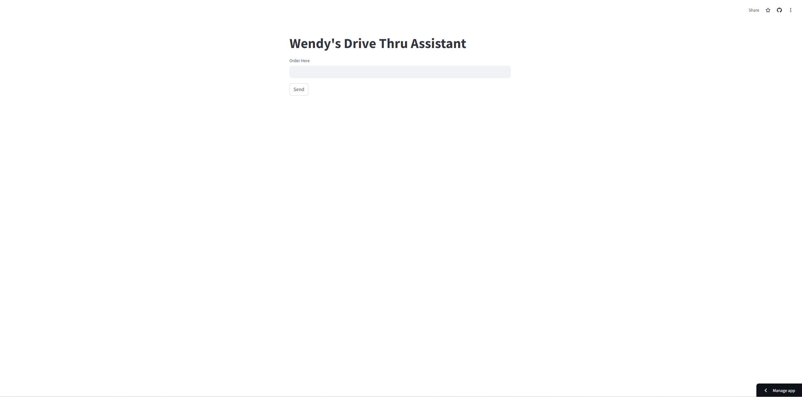
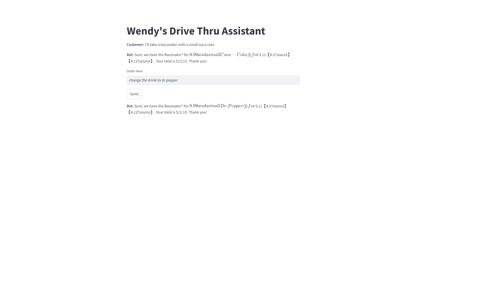
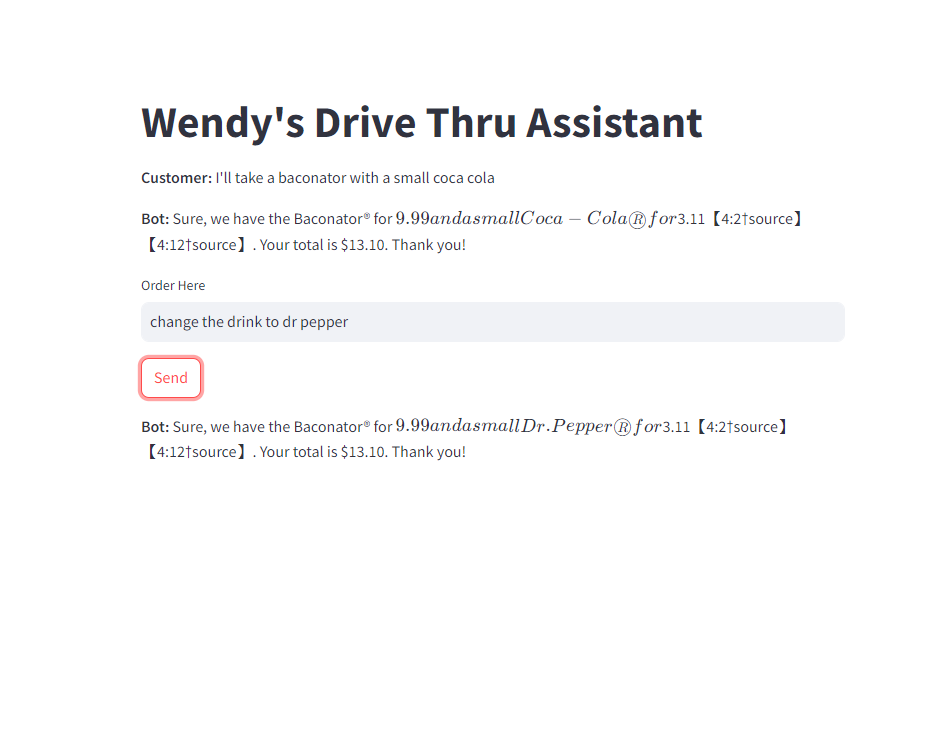

# SelfServiceDriveThruApp
# Drive-Thru Innovation: FreshMenuAI Project

This project is inspired by Wendy's FreshAI drive-thru innovation, which leverages artificial intelligence to enhance the customer experience by making it faster, more accurate, and more personalized. Wendy's implementation of AI in their drive-thru showcases how modern technology can revolutionize traditional processes.

## Table of Contents
- [Overview](#overview)
- [Features](#features)
- [Setup](#setup)
- [Usage](#usage)
- [Contributing](#contributing)
- [License](#license)

## Overview
Preview App Here: https://selfservicedrivethruapp-pjasphwghjfma3trnv88jw.streamlit.app/

This project aims to replicate and expand upon the AI-driven drive-thru concept introduced by Wendy's. The application uses AI technologies to streamline the ordering process, improve order accuracy, and provide personalized menu suggestions. The goal is to create a seamless and efficient drive-thru experience.

### Inspiration
Wendy's FreshAI initiative demonstrates the potential of AI to transform the fast-food industry. By integrating AI into their drive-thru systems, Wendy's has achieved significant improvements in speed and customer satisfaction. You can read more about Wendy's drive-thru innovation [here](https://www.wendys.com/blog/drive-thru-innovation-wendys-freshai).

## Features
- **Order Accuracy:** Uses AI to verify order details and reduce errors.
- - **Real-Time Processing:** Handles multiple orders simultaneously with minimal latency.

## Setup
To set up the project locally, follow these steps:
   ```sh
   git clone https://github.com/yourusername/yourproject.git
   cd yourproject

   pip install -r requirements.txt

## Usage
The data is based off of Wendy's menu. Try saying things like:
- I'll take a Pretzel Baconator with a triple berry frosty.
- I'll take a 6 piece chicken nugget meal.
- etc.

Here are some screenshots of the application in action:






